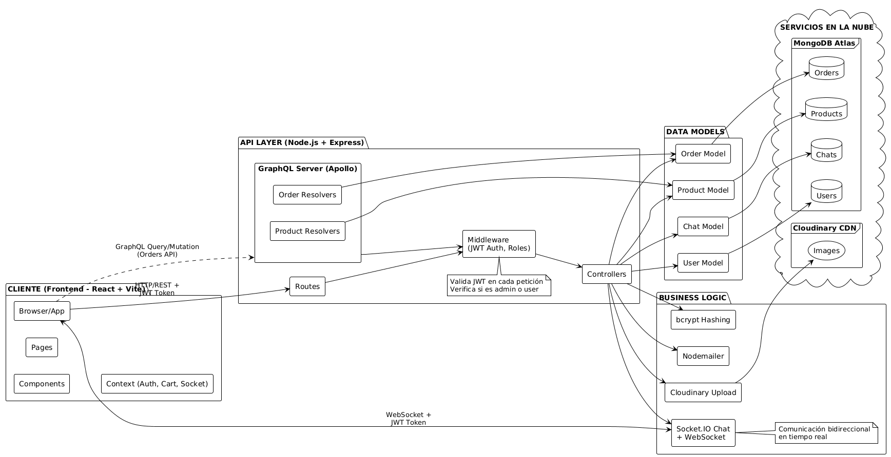

# A Priori Verde

Aplicación web de e-commerce de plantas con panel de administración, carrito completo con checkout, sistema de órdenes con GraphQL, y chat en tiempo real (usuario ↔ admin).

## Características

### Cliente (Usuario)
- Catálogo con filtros por categoría y precio, paginación
- Detalle de producto con galería e información de cuidado
- Carrito de compras con persistencia en localStorage
- Checkout completo: formulario de envío + datos de facturación
- Modal de pago con Stepper (3 pasos: tarjeta, CVV, confirmación)
- "Mis Pedidos": ver historial de compras y seguimiento de estado
- Chat en tiempo real con administrador (Socket.IO)
- Autenticación JWT (login/registro)

### Administrador
- Panel de administración con tabs: Productos, Usuarios, Pedidos, Chats
- **CRUD de Productos**: crear, editar, eliminar
- **CRUD de Usuarios**: gestionar roles y datos
- **Gestión de Órdenes**: ver lista, filtrar por estado, cambiar estado
- **Chat en tiempo real**: bandeja de conversaciones con usuarios
- Subida de imágenes a Cloudinary
- Acceso protegido por rol

### API & Backend
- **GraphQL** (Apollo Server) para operaciones de órdenes
  - Product Queries: `products()`, `productById()`, `productBySlug()`, `searchProducts()`, etc.
  - Order Queries: `orders()`, `orderById()`, `userOrders()`
  - Order Mutations: `createOrder()`, `updateOrderStatus()`, `cancelOrder()`
- REST API para autenticación, productos y usuarios
- Autenticación JWT con roles (usuario/admin)
- Rate limiting y bloqueo de cuenta (5 intentos fallidos)
- Encriptación bcrypt de contraseñas

## Arquitectura



Ver más en: `docs/ARQUITECTURA.puml` (diagrama completo) y `docs/ARQUITECTURA_ACTUALIZADA.puml` (con GraphQL)


## Stack

- **Backend**: Node.js + Express 5, Apollo Server (GraphQL), MongoDB + Mongoose, JWT, bcrypt, Cloudinary, Socket.IO
- **Frontend**: React 18 + Vite, Chakra UI, React Router 7, socket.io-client
- **Infraestructura**: Docker Compose, Nginx (SPA + proxy), MongoDB 6.0

## Documentación

### Prácticas
- **[PRACTICA2.md](./docs/PRACTICA2.md)** - Implementación detallada de GraphQL, órdenes, checkout y modal de pago
- **[PRACTICA1.md](./docs/DESARROLLO.md)** - Documentación de Práctica 1 (base del proyecto)

### Técnica
- **[ARQUITECTURA_ACTUALIZADA.puml](./docs/ARQUITECTURA_ACTUALIZADA.puml)** - Diagrama con GraphQL
- **[ARQUITECTURA.puml](./docs/ARQUITECTURA.puml)** - Diagrama completo del sistema
- **[ENTREGA.puml](./docs/ENTREGA.puml)** - Información de entrega del proyecto
- **[AUTHENTICATION.md](./docs/AUTHENTICATION.md)** - Sistema de autenticación JWT
- **[BACKEND.md](./docs/BACKEND.md)** - API REST y endpoints
- **[CHAT.md](./docs/CHAT.md)** - Chat en tiempo real con Socket.IO
- **[DOCKER.md](./docs/DOCKER.md)** - Configuración Docker Compose
- **[ENVIRONMENT.md](./docs/ENVIRONMENT.md)** - Variables de entorno
- **[SEEDING.md](./docs/SEEDING.md)** - Seeders de datos
- **[DESARROLLO.md](./docs/DESARROLLO.md)** - Guía de desarrollo local

## Inicio Rápido

### Con Docker (Recomendado)

```powershell
# 1. Clonar repositorio
git clone https://github.com/enmabry/ProyectoProgramaci-nWeb.git
cd ProyectoProgramaci-nWeb

# 2. Configurar variables de entorno
cp .env.example .env
# Editar .env con credenciales (Cloudinary, MongoDB, etc.)

# 3. Levantar servicios
docker compose up -d

# 4. Ejecutar seeders
docker compose exec backend npm run seed:admin
docker compose exec backend npm run seed:products

# 5. Acceder
# Frontend: http://localhost:8080
# API/GraphQL: http://localhost:3000/graphql
```

### Modo Local

```powershell
# Backend
npm install
npm run dev  # Puerto 3000

# Frontend (en otra terminal)
cd client
npm install
npm run dev  # Puerto 5173
```

## Credenciales de Prueba

**Administrador:**
- Email: `admin@aprioriverde.com`
- Contraseña: `Admin123`

Para regenerar: `npm run seed:admin`

## Estructura del Proyecto

```
.
├─ src/                          # Backend (Express + GraphQL)
│  ├─ graphql/                   # Apollo Server, resolvers, typedefs
│  ├─ models/                    # Mongoose models (User, Product, Order, Chat)
│  ├─ routes/                    # REST API routes
│  ├─ middleware/                # JWT, auth, validations
│  └─ config/                    # Cloudinary, Swagger, etc.
├─ client/                       # Frontend (React + Vite)
│  ├─ src/
│  │  ├─ pages/                  # DashboardPage, CartPage, AdminPage, ProfilePage, etc.
│  │  ├─ components/             # NavbarGlass, OrdersTab, MyOrdersTab, PaymentModal, etc.
│  │  ├─ context/                # AuthContext, CartContext, SocketContext
│  │  └─ styles/                 # CSS modular
├─ docs/                         # Documentación completa
└─ docker-compose.yml            # Orquestación de servicios
```

## Características de Seguridad

- Encriptación bcrypt (contraseñas)
- JWT con expiración (7 días)
- Rate limiting (20 intentos/10 minutos)
- Account lockout (5 intentos fallidos → 15 minutos bloqueado)
- Validación de roles (user/admin)
- CORS configurado
- Validación JWT en Socket.IO

## Flujo de Compra

1. Usuario navega catálogo → Agrega productos al carrito
2. Va a `/cart` → Rellena formulario de envío
3. Hace clic "Finalizar compra" → Se abre PaymentModal
4. Completa 3 pasos: tarjeta, CVV, confirmación
5. Confirma pago → Se crea orden con GraphQL `createOrder()`
6. Redirige a `/profile` → Ve su nueva orden en "Mis Pedidos"
7. Admin en `/admin` → Pedidos → Ve la orden y puede cambiar estado
8. Usuario ve actualizaciones en tiempo real en "Mis Pedidos"

## Troubleshooting

Ver `docs/DESARROLLO.md` para soluciones a problemas comunes con Docker, puertos y bases de datos.

---
