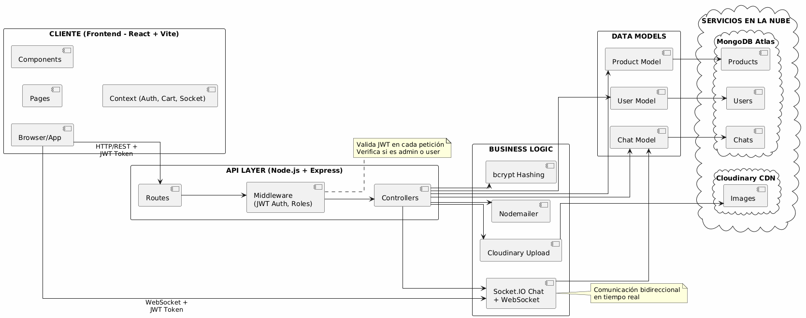

# A Priori Verde

Aplicación web de e-commerce de plantas con panel de administración, carrito, filtros, detalle de producto y chat en tiempo real (usuario ↔ admin).

## Arquitectura



## Características

- Catálogo con filtros por categoría y precio, paginación y destacados
- Vista de detalle con galería e información de cuidado (luz, riego, temperatura)
- Carrito con persistencia en localStorage
- Autenticación con JWT y roles (usuario y admin)
- Panel de administración: CRUD de productos con subida a Cloudinary
- Chat en tiempo real con Socket.IO (widget de usuario y bandeja de admin)
- Docker Compose para levantar MongoDB, API y Frontend


## Stack

- Backend: Node.js + Express, Mongoose/MongoDB, Multer + Cloudinary, Socket.IO
- Frontend: React + Vite, Chakra UI, React Router, socket.io-client
- Infra: Docker, Nginx (SPA + proxy a API y WebSockets)

## Estructura

```
.
├─ src/                 # Backend (Express + Socket.IO)
├─ client/              # Frontend (React + Vite)
├─ docs/                # Documentación
├─ docker-compose.yml   # Orquestación de servicios
└─ .env                 # Variables (ver docs/ENVIRONMENT.md)
```

## Inicio rápido (Docker - recomendado)

```powershell
docker compose up -d
docker compose exec backend npm run seed:admin
docker compose exec backend npm run seed:products
```

- Frontend: http://localhost:8080
- API/Socket: http://localhost:3000

Ver `docs/DESARROLLO.md` para guía completa de desarrollo con Docker.

## Modo local (opcional)

1. Backend
   - Copia `.env.example` a `.env` y completa credenciales
   - `npm install`
   - `npm run dev` (puerto 3000 por defecto)

2. Frontend
   - `cd client`
   - `npm install`
   - `npm run dev` (puerto 5173)

3. Semillas (opcional)
   - `npm run seed:admin`
   - `npm run seed:products`

## Documentación

- **Desarrollo**: `docs/DESARROLLO.md` (guía completa Docker)
- Autenticación: `docs/AUTHENTICATION.md`
- Backend: `docs/BACKEND.md`
- Frontend: `client/README.md`
- Chat tiempo real: `docs/CHAT.md`
- Variables de entorno: `docs/ENVIRONMENT.md`
- Docker: `docs/DOCKER.md`
- Semillas: `docs/SEEDING.md`
- Arquitectura: `docs/ARCHITECTURE.md`

## Autenticación y Roles

Bienvenido a **A Priori Verde**, un e‑commerce minimalista para vender plantas. El proyecto integra **autenticación JWT**, **roles (user/admin)**, **CRUD de productos** con **MongoDB**, y **chat en tiempo real** con **Socket.IO**.

> Pensado para correr fácil en local y listo para desplegar con **MongoDB Atlas** + un PaaS (Render/Railway/Fly).

---
